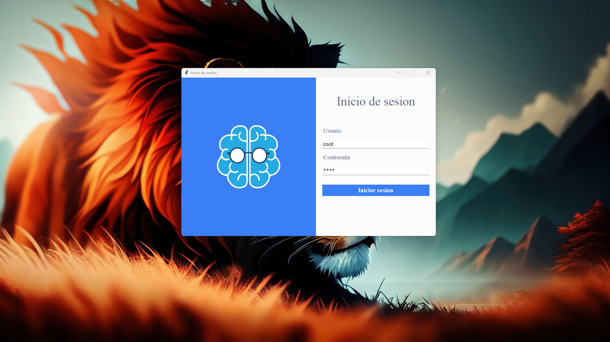

# Tutorial de Inicio de Sesión de Usuarios en Python

Este proyecto tutorial tiene como objetivo enseñarte a crear una aplicación de inicio de sesión en Python, donde los usuarios pueden acceder utilizando un nombre de usuario y una contraseña. Además, al proporcionar credenciales incorrectas, se mostrará un mensaje de error, mientras que el acceso exitoso abrirá una ventana principal.

## Requisitos

- Python 3.9 o superior
- Paquete Pillow==10.0.1

Puedes instalar los requisitos con el siguiente comando:

```bash
pip install -r requirements.txt
```
## Descripción

En este tutorial, nos enfocaremos en crear una interfaz gráfica para el inicio de sesión de usuarios, validando las credenciales proporcionadas. En caso de error, se mostrará un mensaje correspondiente, mientras que en caso de éxito, se abrirá una ventana principal para la aplicación.

 


## Instalación y Uso

1. Clona este repositorio en tu máquina local.
2. Instala los requisitos con `pip install -r requirements.txt`.
3. Ejecuta la aplicación con `python main.py`.

## Contribuir

Si deseas contribuir a este proyecto, por favor sigue estos pasos:

1. Haz un fork del repositorio.
2. Crea una nueva rama (`git checkout -b feature/feature-name`).
3. Haz tus cambios y realiza commit (`git commit -am 'Add new feature'`).
4. Haz push a la rama (`git push origin feature/feature-name`).
5. Crea un pull request.

## Licencia

Este proyecto está bajo la Licencia MIT. Consulta el archivo [LICENSE](LICENSE) para más detalles.

## Autor

Este proyecto fue creado por Jesús Gutiérrez López. Puedes contactar al autor en jesus.gutierrez@autodidactamx.com.
