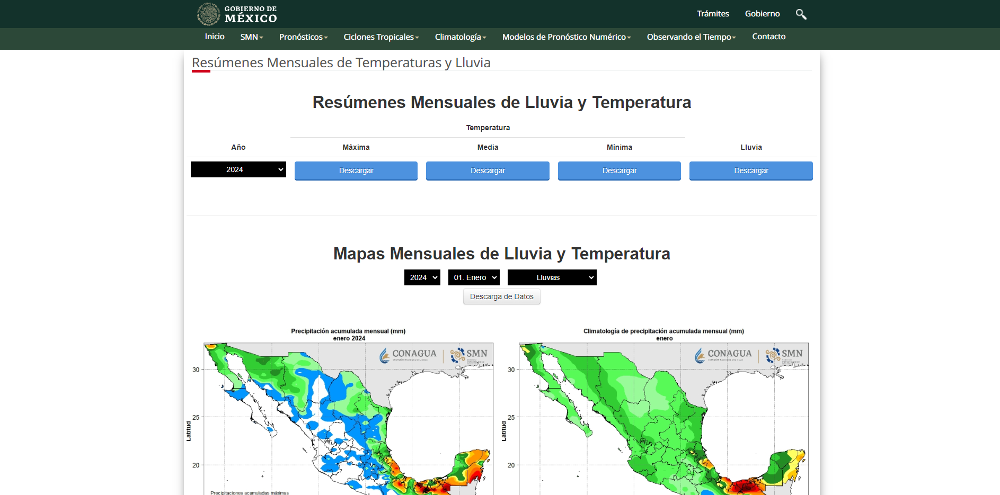
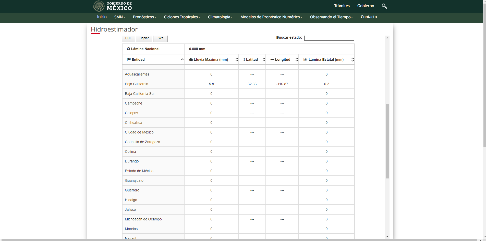
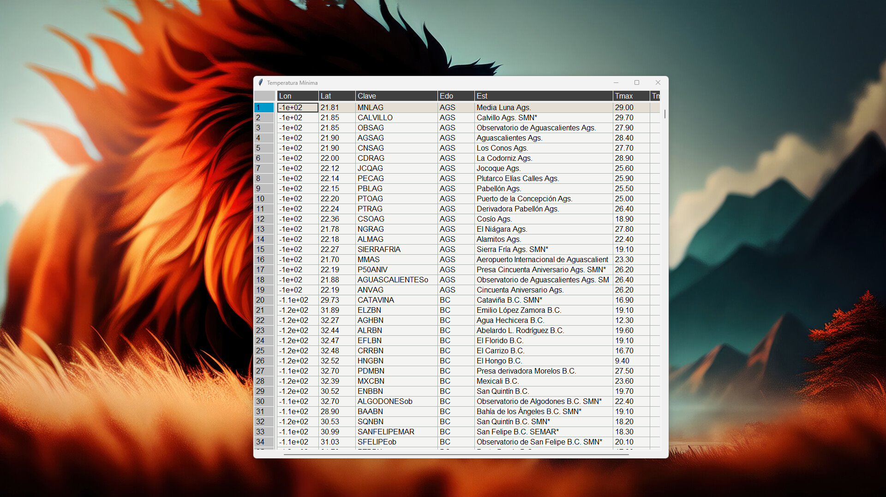

# Tutorial Como hacer Web Scraping con Python | Extraer Datos de la Web
Este proyecto tutorial tiene como objetivo enseñarte cómo extraer datos de páginas web utilizando Python y la herramienta Selenium. Selenium te permite automatizar la interacción con páginas web, lo que facilita la extracción de información y la realización de acciones en sitios web, como seleccionar elementos de menú desplegable y hacer clic en botones para descargar archivos.

## ¿Qué es Web Scraping?

Web Scraping es una técnica utilizada para extraer datos de páginas web de manera automatizada. Puede ser útil para recopilar información de diferentes fuentes en la web, como precios de productos, noticias, opiniones de usuarios, entre otros.

## ¿Por qué usar Python y Selenium para Web Scraping?

Python es un lenguaje de programación versátil y fácil de aprender, con una amplia variedad de bibliotecas disponibles para diferentes tareas, incluido el Web Scraping. Selenium es una de esas bibliotecas y se utiliza específicamente para la automatización de pruebas y la interacción con páginas web.

## Requisitos

- Tener Python instalado en tu sistema. Puedes descargarlo desde [python.org](https://www.python.org/downloads/).
- [ChromeDriver] (https://chromedriver.chromium.org/downloads) para Google Chrome.
- Tener Instalado Paquete selenium==4.7.2
- Tener Instalado Paquete pandas==1.5.3
- Tener Instalado Paquete pandastable==0.13.1

Puedes instalar los requisitos con el siguiente comando:

```bash
pip install -r requirements.txt
```
## Descripción

Este tutorial te introduce a una arquitectura básica de capas, donde separamos la lógica en diferentes componentes:

1. **Capa de Presentación:** Utilizamos command-line interface (CLI) mediante argumentos de entrada para ejecutar el programa de extracción.
2. **Capa de Servicio o Aplicación:** Aquí se encuentra la lógica de la aplicación donde dividimos por servicios la invocación del programa. Cada servicio se ve como un caso de uso.

Al separar la aplicación en estas tres capas, facilitamos la comprensión y mantenimiento del código, además de permitir una distribución más eficiente.

### Servicio de ExtraccionDatosClimaticosService
 
### Servicio de ExtraccionTablaHidroestimadorService
 
### Resultado Pandas Table
 


## Instalación y Uso

1. Clona este repositorio en tu máquina local.
2. Instala los requisitos con `pip install -r requirements.txt`.
3. Ejecuta la aplicación con `python main.py`.

## Contribuir

Si deseas contribuir a este proyecto, por favor sigue estos pasos:

1. Haz un fork del repositorio.
2. Crea una nueva rama (`git checkout -b feature/feature-name`).
3. Haz tus cambios y realiza commit (`git commit -am 'Add new feature'`).
4. Haz push a la rama (`git push origin feature/feature-name`).
5. Crea un pull request.

## Licencia

Este proyecto está bajo la Licencia MIT. Consulta el archivo [LICENSE](LICENSE) para más detalles.

## Autor

Este proyecto fue creado por Jesús Gutiérrez López. Puedes contactar al autor en jesus.gutierrez@autodidactamx.com.